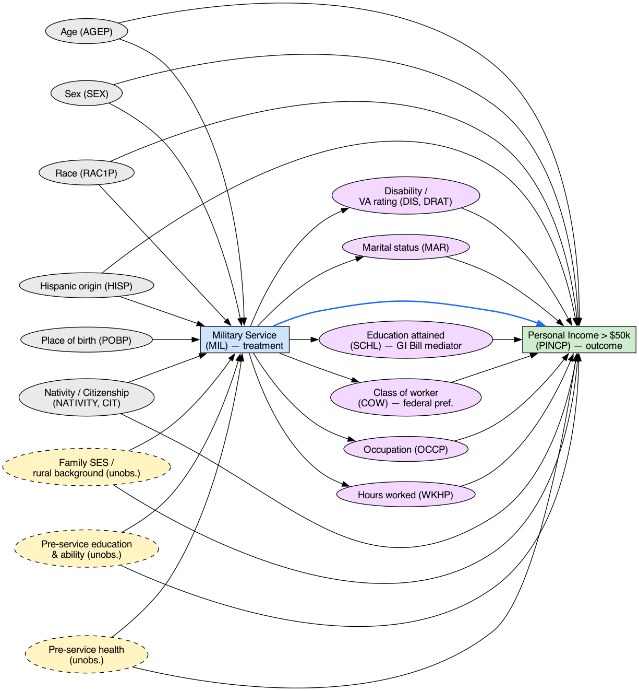

# Causal Inference Project — Military Service & Personal Income

Course: 097400 Introduction to Causal Inference.

## Causal Question

Does serving in the US military causally increase a veteran's personal
income compared to otherwise similar civilians?

- **Treatment:** `MIL` — ever served on active duty vs. never served (binary).
- **Outcome:** `PINCP` — personal income, binarized at $50k/year.
- **Temporal ordering:** Military service is a completed past event; current
  income cannot have caused prior service. The ordering is structurally
  guaranteed by the variable.
- **Confounding:** Enlistment is non-random. People who serve disproportionately
  come from lower-income, rural backgrounds with lower pre-service education —
  all of which independently depress income. At the same time, service confers
  job training, federal hiring preferences, and GI Bill benefits that raise
  income. Background SES and military-specific human capital therefore both
  affect who serves *and* what they earn — classic confounding.

See [docs/Causal Project Ideas.docx](docs/Causal%20Project%20Ideas.docx) for
two additional candidate questions (education → employment; citizenship →
income) and [docs/Project Guidelines.pdf](docs/Project%20Guidelines.pdf) for
the assignment spec.

## Data

Source: [folktables](https://github.com/socialfoundations/folktables) ACS PUMS,
2018 1-Year, person survey, all 50 states + DC + PR.

`acs_2018_slim.csv.zip` is a single combined CSV across all states, reduced to
the columns relevant to the causal question:

| Role | Columns |
|---|---|
| Treatment | `MIL` |
| Outcome | `PINCP` (binarize at $50k downstream) |
| Pre-treatment confounders | `AGEP`, `SEX`, `RAC1P`, `HISP`, `POBP`, `NATIVITY`, `CIT`, `LANX`, `ENG` |
| Outcome-side covariates / mediators | `SCHL`, `MAR`, `ESR`, `COW`, `OCCP`, `WKHP`, `WAGP`, `DIS`, `DEAR`, `DEYE` |
| Veteran-specific | `DRAT`, `VPS` |
| Geography / weighting | `ST`, `PWGTP` |

Column definitions live in the ACS PUMS data dictionary:
https://www.census.gov/programs-surveys/acs/microdata/documentation.html

### Loading the data

```python
import pandas as pd
df = pd.read_csv("acs_2018_slim.csv.zip")
```

### Regenerating the slim file from raw ACS

```bash
pip install folktables pandas pyarrow
python scripts/download_folktables.py   # pulls per-state CSVs into data/
python scripts/prepare_dataset.py        # writes acs_2018_slim.csv.gz
```

The raw per-state CSVs (~2.1 GB) are not committed; the script above
reproduces them.

## Causal Graph



Generated by [scripts/causal_graph.py](scripts/causal_graph.py). Blue edge =
the direct treatment effect of interest. Dashed yellow nodes are unobserved
background confounders (family SES, pre-service education / ability,
pre-service health).

## Repository layout

```
.
├── README.md
├── acs_2018_slim.csv.zip      # combined dataset, all states
├── causal_graph.png            # preliminary DAG
├── docs/                       # assignment spec + project ideas
└── scripts/                    # download / slim / DAG-rendering scripts
```
